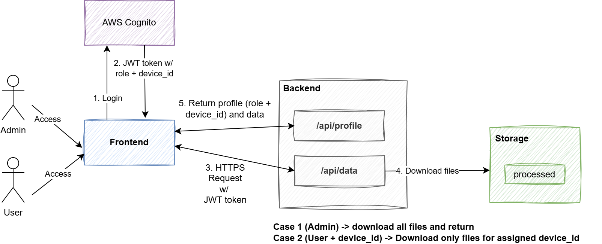

# Energy Monitoring System - Cloud Computing Project

A full-stack cloud-based application for monitoring solar panel energy consumption with real-time data visualization and user authentication.

## Architecture

- **Frontend**: Streamlit (Python) - Interactive dashboard with data visualization
- **Backend**: FastAPI (Python) - REST API with JWT authentication
- **Authentication**: AWS Cognito - User management and authorization
- **Storage**: Azure Blob Storage - Time-series data storage
- **Hosting**: Azure App Service - Serverless deployment
- **CI/CD**: GitHub Actions - Automated deployment pipeline



## Project Structure
```
.
├── backend/
│   ├── main.py                 # FastAPI application
│   ├── auth.py                 # AWS Cognito authentication
│   ├── blob_reader.py          # Azure Blob Storage data access
│   ├── requirements.txt        # Python dependencies
│   └── start.sh               # Startup script
├── frontend/
│   ├── app.py                 # Streamlit application
│   ├── requirements.txt       # Python dependencies
│   └── start.sh              # Startup script
└── .github/
    └── workflows/
        └── deploy.yml        # CI/CD pipeline
```

## AWS Cognito Configuration

### 0. Prerequisites

- AWS account with Cognito permissions (available in Free Tier)
- Region: `eu-central-1` (or your preferred region)

### 1. Create Cognito User Pool

1. Go to **AWS Console → Amazon Cognito → User Pools → Create user pool**
2. Choose **Single-page application (SPA)**
3. Name your application (e.g., `energy-monitoring-app`)
4. **Sign-in identifiers** → check **Email**
5. **Return URL** → set your frontend URL:
   - Development: `http://localhost:8501`
   - Production: `https://cc2025-frontend.azurewebsites.net`
6. Click **Create User Directory**

Note the following values:
- **User Pool ID**
- **Cognito Domain**
- **App Client ID**

### 2. Add Custom Attribute: `device_id`

1. Go to **User pools → your pool → Sign-up**
2. Under **Custom attributes** → **Add custom attribute**
3. Configure:
   - **Name:** `device_id`
   - **Type:** `String`
   - **Max length:** 300
   - **Mutable:** true
4. Save

This appears in tokens as:
```json
"custom:device_id": "E-001"
```

### 3. Create Groups (Roles)

Go to **Users management → Groups** and create:

#### Group: `admin`
- Precedence: 0
- IAM role: *(leave empty)*

#### Group: `user`
- Precedence: 10
- IAM role: *(leave empty)*

ID tokens include:
```json
"cognito:groups": ["admin"]
```
or
```json
"cognito:groups": ["user"]
```

### 4. App Client Configuration

Go to **App clients → Login pages** and configure:

- **OAuth grant types:**
  - Authorization code grant
- **OpenID Connect scopes:**
  - `openid`
  - `email`
  - `profile` *(required for custom attribute)*
- **Callback URLs:**
  - Development: `http://localhost:8501`
  - Production: `https://cc2025-frontend.azurewebsites.net`
- **Logout URLs:**
  - Development: `http://localhost:8501`
  - Production: `https://cc2025-frontend.azurewebsites.net`

Record:
- **App Client ID**
- **Cognito Domain**

### 5. Create Users

#### Create Admin User
1. **User management → Users → Create user**
2. Email: `admin@test.com`
3. Set temporary password
4. **Groups** → Add to `admin` group
5. **Do NOT assign** `custom:device_id`

#### Create Regular User
1. **User management → Users → Create user**
2. Email: `user@test.com`
3. Set temporary password
4. **User Attributes** → Add:
   - `custom:device_id` = `E-001`
5. **Groups** → Add to `user` group

### 6. Example ID Token
```json
{
  "email": "user@test.com",
  "cognito:groups": ["user"],
  "custom:device_id": "E-001"
}
```

## Local Development

### Backend Setup
```bash
cd backend

# Create virtual environment
python -m venv venv
source venv/bin/activate  # Windows: venv\Scripts\activate

# Install dependencies
pip install -r requirements.txt

# Create .env file
cat > .env << EOF
COGNITO_ISSUER=https://cognito-idp.eu-central-1.amazonaws.com/eu-central-1_XXXXXXXXX
COGNITO_CLIENT_ID=your_client_id
AZURE_STORAGE_CONNECTION_STRING=your_connection_string
AZURE_BLOB_CONTAINER=processed
LATEST_PREFIX=latest/
HISTORICAL_PREFIX=by-timestamp/
EOF

# Run backend
uvicorn main:app --reload --port 8000
```

### Frontend Setup
```bash
cd frontend

# Create virtual environment
python -m venv venv
source venv/bin/activate  # Windows: venv\Scripts\activate

# Install dependencies
pip install -r requirements.txt

# Create .env file
cat > .env << EOF
COGNITO_DOMAIN=https://your-domain.auth.eu-central-1.amazoncognito.com
COGNITO_CLIENT_ID=your_client_id
REDIRECT_URI=http://localhost:8501
BACKEND_URL=http://localhost:8000
EOF

# Run frontend
streamlit run app.py
```

## Azure Deployment

### Environment Variables

#### Backend App Service
**Azure Portal → App Service → Configuration → Application settings:**
```
COGNITO_ISSUER = https://cognito-idp.eu-central-1.amazonaws.com/eu-central-1_XXXXXXXXX
COGNITO_CLIENT_ID = your_cognito_client_id
AZURE_STORAGE_CONNECTION_STRING = DefaultEndpointsProtocol=https;AccountName=...
AZURE_BLOB_CONTAINER = processed
LATEST_PREFIX = latest/
HISTORICAL_PREFIX = by-timestamp/
SCM_DO_BUILD_DURING_DEPLOYMENT = true
```

#### Frontend App Service
```
COGNITO_DOMAIN = https://your-domain.auth.eu-central-1.amazoncognito.com
COGNITO_CLIENT_ID = your_cognito_client_id
REDIRECT_URI = https://cc2025-frontend.azurewebsites.net
BACKEND_URL = https://cc2025-backend.azurewebsites.net
SCM_DO_BUILD_DURING_DEPLOYMENT = true
```

### GitHub Secrets

**Repository → Settings → Secrets and variables → Actions:**
```
AZURE_WEBAPP_PUBLISH_PROFILE_BACKEND = <backend_publish_profile_xml>
AZURE_WEBAPP_PUBLISH_PROFILE_FRONTEND = <frontend_publish_profile_xml>
```

Get publish profiles:
```bash
az webapp deployment list-publishing-profiles --name cc2025-backend --resource-group  --xml
az webapp deployment list-publishing-profiles --name cc2025-frontend --resource-group  --xml
```

### Deploy
```bash
git add .
git commit -m "Deploy to Azure"
git push origin main
```

## Data Storage Structure

### Azure Blob Storage
```
processed/
├── latest/
│   ├── device-E-001.json
│   ├── device-E-002.json
│   └── ...
└── historical/
    ├── 2026-01-20_120000/
    │   ├── device-E-001.json
    │   └── ...
    └── 2026-01-21_093000/
        └── ...
```

### Data Format
```json
{
  "device_id": "E-001",
  "total_kwh": 1234.56,
  "generation_timestamp": "2026-01-21T12:00:00Z"
}
```

## Authentication Flow

1. User clicks "Login with AWS Cognito" in Streamlit
2. Redirected to Cognito Hosted UI
3. After login, receives authorization code
4. Frontend exchanges code for JWT tokens
5. ID token sent to backend: `Authorization: Bearer <token>`
6. Backend verifies JWT using Cognito JWKS:
```
   https://cognito-idp.eu-central-1.amazonaws.com/eu-central-1_XXXXXXXXX/.well-known/jwks.json
```
7. Backend reads claims for authorization:
   - `cognito:groups` → role-based access
   - `custom:device_id` → device filtering

## Features

### Backend (FastAPI)
- ✅ JWT token validation with AWS Cognito
- ✅ Role-based access control (admin/user)
- ✅ Device-level filtering
- ✅ REST API endpoints:
  - `GET /` - API information
  - `GET /health` - Health check
  - `GET /api/profile` - User profile
  - `GET /api/data` - Latest energy data
  - `GET /api/history` - Historical data (admin only)

### Frontend (Streamlit)
- OAuth2 login with Cognito
- Interactive dashboard
- Admin features:
  - View all devices
  - Historical analysis
  - Heatmap visualization
  - Statistical charts
- User features:
  - View personal device only
  - Real-time metrics

## Screenshots

See `images/` folder for:
- Admin view
- User view
- Architecture diagram
